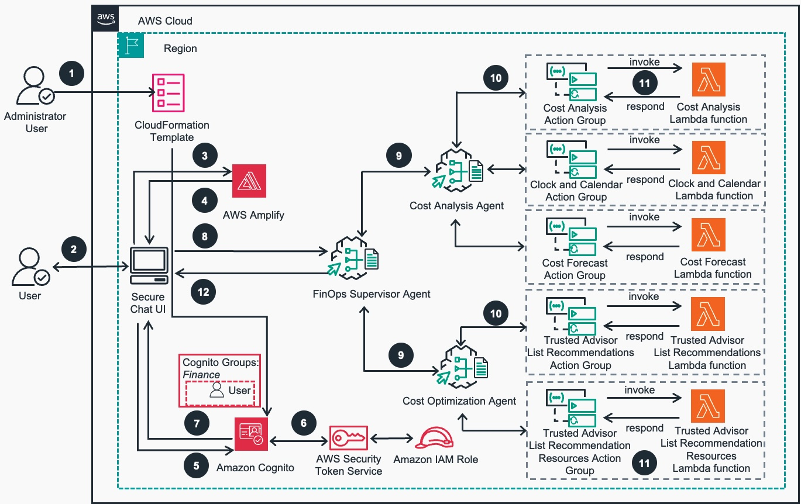

<!--
> [!NOTE]
> The content presented here serves as an example intended solely for educational objectives and should not be implemented in a live production environment without proper modifications and rigorous testing.
-->

# Guidance for Cost Analysis and Optimization with Amazon Bedrock Agents 

## Table of Contents
- 📋 [Overview](#overview)
- 🏗️ [Guidance overview](#guidance-overview)
- ✅ [Prerequisites](#prerequisites)
- 🚀 [Deploy the Guidance](#deploy-the-guidance)
<!--
- 💻 [Deploy the Amplify application](#deploy-the-amplify-application)
- 🔐 [Amazon Cognito for user authentication](#amazon-cognito-for-user-authentication)
- 🤖 [Amazon Bedrock Agents with multi-agent capability](#amazon-bedrock-agents-with-multi-agent-capability)
- ⚡ [Lambda functions for Amazon Bedrock action groups](#lambda-functions-for-amazon-bedrock-action-groups)
- 🌐 [Amplify for frontend](#amplify-for-frontend)
- 🔄 [Multi-agent and application walkthrough](#multi-agent-and-application-walkthrough)
- 🧹 [Clean up](#clean-up)
-->
- 💡 [Considerations](#considerations)
- 📝 [Conclusion](#conclusion)
- 📚 [Additional resources](#additional-resources)
- 💰 [Cost](#cost)
- ➡️ [Next Steps](#next-steps)
- ❓ [FAQ, Known Issues, Additional Considerations, and Limitations](#faq-known-issues-additional-considerations-and-limitations)
- 📋 [Revisions](#revisions)
- ⚠️ [Notices](#notices)
- 👥 [Authors](#authors)
- 🔒 [Security](#security)
- 📜 [License](#license)

## Overview

AI agents are revolutionizing how businesses enhance their operational capabilities and enterprise applications. By enabling natural language interactions, these agents provide customers with a streamlined, personalized experience. [Amazon Bedrock Agents](https://aws.amazon.com/bedrock/agents/) uses the capabilities of foundation models (FMs), combining them with APIs and data to process user requests, gather information, and execute specific tasks effectively. The introduction of now enables organizations to orchestrate multiple specialized AI agents working together to tackle complex, multi-step challenges that require diverse expertise. 

[Amazon Bedrock](https://aws.amazon.com/bedrock/) offers a diverse selection of FMs, allowing you to choose the one that best fits your specific use case. Among these offerings, [Amazon Nova](https://aws.amazon.com/ai/generative-ai/nova/) stands out as AWS's next-generation FM, delivering breakthrough intelligence and industry-leading performance at exceptional value.

The Amazon Nova family comprises two types of models:

* Understanding models – Available in Micro, Lite, and Pro variants
* Content generation models – Featuring Canvas and Reel

These models are specifically optimized for enterprise and business applications, excelling in the following capabilities:

* Text generation
* Summarization
* Complex reasoning tasks
* Content creation

This makes Amazon Nova ideal for sophisticated use cases like our FinOps solution.

A key advantage of the Amazon Nova model family is its [industry-leading price-performance ratio](https://aws.amazon.com/blogs/aws/introducing-amazon-nova-frontier-intelligence-and-industry-leading-price-performance/). Compared to other enterprise-grade AI models, Amazon Nova offers comparable or superior capabilities at a more competitive price point. This cost-effectiveness, combined with its versatility and performance, makes Amazon Nova an attractive choice for businesses looking to implement advanced AI solutions.

In this guidance, we use the [multi-agent](https://docs.aws.amazon.com/bedrock/latest/userguide/agents-multi-agent-collaboration.html) feature of Amazon Bedrock to demonstrate a powerful and innovative approach to [AWS cost management](). By using the advanced capabilities of Amazon Nova FMs, we've developed a solution that showcases how AI-driven agents can revolutionize the way organizations analyze, optimize, and manage their AWS costs.

## Guidance overview

Our innovative AWS cost management guidance uses the power of AI and multi-agent collaboration to provide comprehensive cost analysis and optimization recommendations. The core of the system is built around three key components:

* FinOps supervisor agent – Acts as the central coordinator, managing user queries and orchestrating the activities of specialized subordinate agents
* Cost analysis agent – Uses [AWS Cost Explorer](https://aws.amazon.com/aws-cost-management/aws-cost-explorer/) to gather and analyze cost data for specified time ranges
* Cost optimization agent – Uses the [AWS Trusted Advisor Cost Optimization Pillar](https://aws.amazon.com/premiumsupport/technology/trusted-advisor/) to provide actionable cost-saving recommendations

The guidance integrates the multi-agent collaboration capabilities of Amazon Bedrock with Amazon Nova to create an intelligent, interactive, cost management AI assistant. This integration enables seamless communication between specialized agents, each focusing on different aspects of AWS cost management. Key features of the guidance include:

* User authentication through [Amazon Cognito](https://aws.amazon.com/cognito/) with [role-based access control](https://docs.aws.amazon.com/cognito/latest/developerguide/role-based-access-control.html)
* Frontend application hosted on [AWS Amplify](https://aws.amazon.com/amplify/)
* Real-time cost insights and historical analysis
* Actionable cost optimization recommendations
* Parallel processing of tasks for improved efficiency

By combining AI-driven analysis with AWS cost management tools, this guidance offers finance teams and cloud administrators a powerful, user-friendly interface to gain deep insights into AWS spending patterns and identify cost-saving opportunities.

The architecture displayed in the following diagram uses several AWS services, including [AWS Lambda](https://aws.amazon.com/lambda/) functions, to create a scalable, secure, and efficient system. This approach demonstrates the potential of AI-driven multi-agent systems to assist with cloud financial management and solve a wide range of cloud management challenges.

*Figure 1. Reference Architecture of Cost Analysis and Optimization with Amazon Bedrock Agents*

<u>Architecture Workflow</u>:

1. The Administrator User deploys the guidance to AWS Account and Region using an AWS CloudFormation Template.
The Base AWS CloudFormation stack will deploy and create all of the AWS resources needed to host the guidance. This includes Amazon Cognito User group and user, Amazon Bedrock Agents, AWS Lambda Functions, AWS Identity and Access Management (IAM) roles and AWS STS token.
2. The user navigates to the Secure Chat UI URL
3. Secure Chat  application is hosted on AWS Amplify
4. The web page is returned with HTML, CSS, JavaScript.  User is now able to input the configuration details for Amazon Cognito and Amazon Bedrock Agents
5. Upon configuration completion, the user is prompted to authenticate using Amazon Cognito with a username and password configured for them in the user pool
6. After successful authentication, Cognito Identity Pool will negotiate temporary credentials from AWS Simple Token Service (STS)
7. Cognito Identity Pool passes temporary AWS credentials to the Secure Chat UI
8. Once authenticated, the user now sees the Secure Chat UI chat prompt to interact with the Amazon Bedrock Agent that is configured
9. The FinOps Supervisor Agent evaluates each User's question and directs it to one of two specialized sub-agents: the Cost Analysis Agent or the Cost Optimization Agent
10. Each specialized agent (Cost Analysis or Cost Optimization) reviews its predefined set of actions to identify the correct procedure for answering the user's question
11. The action groups execute their respective AWS  Lambda functions to fetch data, whether that's accessing the AWS Cost Explorer API or pulling recommendations from Trusted Advisor's Cost Optimization pillar
12. The FinOps Supervisor Agent compiles all the gathered data into a final answer and sends it back to the Secure Chat UI visible to the User

In the following sections, we dive deeper into the architecture of our guidance, explore the capabilities of each agent, and discuss the potential impact of this approach on AWS cost management strategies.

### AWS services in this Guidance

**TO DO: update services in this Guidance details below**

| **AWS Service** | **Role** | **Description** |
|-----------------|----------|-----------------|
| Amazon Bedrock (Nova) | 3,000 requests * 1,000 tokens/request | $30.00 |
| Amazon Cognito | 100 MAU | $0.00 (within free tier) |
| AWS Lambda | 3,000 invocations * 5 functions * 1s avg. duration | $0.00 (within free tier) |
| AWS Amplify | 1 GB storage, 5 GB data transfer | $0.23 |
| Amazon CloudWatch | Basic monitoring + 1 GB logs | $0.50 |
| AWS IAM | N/A | $0.00 |
| AWS Cost Explorer | 3,000 API requests | $0.00 (within free tier) |
| AWS Trusted Advisor | Basic checks | $0.00 |

## Cost
This estimate assumes a relatively simple usage pattern and minimal data storage. The majority of the cost comes from Amazon Bedrock usage. Costs could increase if:

Requests to Bedrock involve larger token counts.
Lambda functions run for longer durations.
More data is stored or transferred through Amplify.
Advanced features of Trusted Advisor are used.

| AWS Service | Usage Estimate | Monthly Cost (USD) |
|-------------|----------------|---------------------|
| Amazon Bedrock (Nova) | 3,000 requests * 1,000 tokens/request | $30.00 |
| Amazon Cognito | 100 MAU | $0.00 (within free tier) |
| AWS Lambda | 3,000 invocations * 5 functions * 1s avg. duration | $0.00 (within free tier) |
| AWS Amplify | 1 GB storage, 5 GB data transfer | $0.23 |
| Amazon CloudWatch | Basic monitoring + 1 GB logs | $0.50 |
| AWS IAM | N/A | $0.00 |
| AWS Cost Explorer | 3,000 API requests | $0.00 (within free tier) |
| AWS Trusted Advisor | Basic checks | $0.00 |
| **Total Estimated Monthly Cost** | | **$30.73** |

## Security

## Supported AWS Regions

**TO DO: validate supported regions**

The core components of the Guidance for Cost Analysis and Optimization with Amazon Bedrock Agents are available in all AWS Regions where Amazon Bedrock (Nova) models are available.

## Deploy the Guidance

### Prerequisites

You must have the following in place to complete the guidance in this post:

* An [AWS account](https://signin.aws.amazon.com/signin?redirect_uri=https%3A%2F%2Fportal.aws.amazon.com%2Fbilling%2Fsignup%2Fresume&client_id=signup)
* FM [access](https://docs.aws.amazon.com/bedrock/latest/userguide/model-access.html) in Amazon Bedrock for Amazon Nova Pro and Micro in the same [AWS Region](https://docs.aws.amazon.com/glossary/latest/reference/glos-chap.html#region) where you will deploy this guidance
* The accompanying [AWS CloudFormation template](http://aws.amazon.com/cloudformation) downloaded from the [aws-samples GitHub repo](https://github.com/aws-samples/sample-finops-bedrock-multiagent-nova)

### Deployment Instructions

**TO DO: change link to Live IG when going live**
Please refer to [Implementation Guide](https://implementationguides.kits.eventoutfitters.aws.dev/cao-aba-0523/storage/cost-analysis-and-optimization-with-amazon-bedrock-agents.html) for detailed instructions for guidance deployment options.

<!-- 
## Deploy guidance resources using AWS CloudFormation

This CloudFormation template is designed to run in the us-east-1 Region. If you deploy in a different Region, you must configure cross-Region [inference profiles](https://docs.aws.amazon.com/bedrock/latest/userguide/inference-profiles-create.html) to have proper functionality and update the CloudFormation template accordingly.

During the CloudFormation template deployment, you will need to specify three required parameters:

* Stack name
* FM selection
* Valid user email address

AWS resource usage will incur costs. When deployment is complete, the following resources will be deployed:

Amazon Cognito resources:
* [User pool](https://docs.aws.amazon.com/cognito/latest/developerguide/cognito-user-pools.html) – CognitoUserPoolforFinOpsApp
* [App client](https://docs.aws.amazon.com/cognito/latest/developerguide/user-pool-settings-client-apps.html) – FinOpsApp
* [Identity pool](https://docs.aws.amazon.com/cognito/latest/developerguide/identity-pools.html) – cognito-identity-pool-finops
* [Groups](https://docs.aws.amazon.com/cognito/latest/developerguide/cognito-user-pools-user-groups.html) – Finance
* [User](https://docs.aws.amazon.com/cognito/latest/developerguide/managing-users.html) – Finance User 

[AWS Identity and Access Management](https://aws.amazon.com/iam/) (IAM) resources:
* [IAM roles](https://docs.aws.amazon.com/IAM/latest/UserGuide/id_roles.html): 
  * FinanceUserRestrictedRole
  * DefaultCognitoAuthenticatedRole
* [IAM policies](https://docs.aws.amazon.com/IAM/latest/UserGuide/access_policies.html): 
  * Finance-BedrockAccess
  * Default-CognitoAccess

AWS Lambda functions:
* TrustedAdvisorListRecommendationResources
* TrustedAdvisorListRecommendations
* CostAnalysis
* ClockandCalendar
* CostForecast 

Amazon Bedrock agents:
* FinOpsSupervisorAgent
* CostAnalysisAgent with action groups:
  * CostAnalysisActionGroup
  * ClockandCalendarActionGroup
  * CostForecastActionGroup
* CostOptimizationAgent with action groups:
  * TrustedAdvisorListRecommendationResources
  * TrustedAdvisorListRecommendations

After you deploy the CloudFormation template, copy the following from the **Outputs** tab on the AWS CloudFormation console to use during the configuration of your application after it's deployed in Amplify:

* AWSRegion
* BedrockAgentAliasId
* BedrockAgentId
* BedrockAgentName
* IdentityPoolId
* UserPoolClientId
* UserPoolId

The following screenshot shows you what the Outputs tab will look like.  

## Deploy the Amplify application

You need to manually deploy the Amplify application using the frontend code found on GitHub. Complete the following steps:

1. Download the frontend code AWS-Amplify-Frontend.zip from [GitHub](https://github.com/aws-samples/sample-finops-bedrock-multiagent-nova).
2. Use the .zip file to manually [deploy](https://docs.aws.amazon.com/amplify/latest/userguide/manual-deploys.html) the application in AWS Amplify.
3. Return to the Amplify page and use the domain it automatically generated to access the application.

## Amazon Cognito for user authentication

The FinOps application uses Amazon Cognito user pools and identity pools to implement secure, role-based access control for finance team members. User pools handle authentication and group management, and identity pools provide temporary AWS credentials mapped to specific IAM roles. The system makes sure that only verified finance team members can access the application and interact with the Amazon Bedrock API, combining robust security with a seamless user experience.

## Amazon Bedrock Agents with multi-agent capability 

The Amazon Bedrock multi-agent architecture enables sophisticated FinOps problem-solving through a coordinated system of AI agents, led by a FinOpsSupervisorAgent. The FinOpsSupervisorAgent coordinates with two key subordinate agents: the CostAnalysisAgent, which handles detailed cost analysis queries, and the CostOptimizationAgent, which handles specific cost optimization recommendations. Each agent focuses on their specialized financial tasks while maintaining contextual awareness, with the FinOpsSupervisorAgent managing communication and synthesizing comprehensive responses from both agents. This coordinated approach enables parallel processing of financial queries and delivers more effective answers than a single agent could provide, while maintaining consistency and accuracy throughout the FinOps interaction.

## Lambda functions for Amazon Bedrock action groups 

As part of this guidance, Lambda functions are deployed to support the action groups defined for each subordinate agent.  

The CostAnalysisAgent uses three distinct Lambda backed action groups to deliver comprehensive cost management capabilities. The CostAnalysisActionGroup connects with Cost Explorer to extract and analyze detailed historical cost data, providing granular insights into cloud spending patterns and resource utilization. The ClockandCalendarActionGroup maintains temporal precision by providing current date and time functionality, essential for accurate period-based cost analysis and reporting. The CostForecastActionGroup uses the [Cost Explorer forecasting](https://docs.aws.amazon.com/cost-management/latest/userguide/ce-forecast.html) function, which analyzes historical cost data and provides future cost projections. This information helps the agent support proactive budget planning and make informed recommendations. These action groups work together seamlessly, enabling the agent to provide historical cost analysis and future spend predictions while maintaining precise temporal context.

The CostOptimizationAgent incorporates two Trusted Advisor focused action groups to enhance its recommendation capabilities. The TrustedAdvisorListRecommendationResources action group interfaces with Trusted Advisor to retrieve a comprehensive list of resources that could benefit from optimization, providing a targeted scope for cost-saving efforts. Complementing this, the TrustedAdvisorListRecommendations action group fetches specific recommendations from Trusted Advisor, offering actionable insights on potential cost reductions, performance improvements, and best practices across various AWS services. Together, these action groups empower the agent to deliver data-driven, tailored optimization strategies by using the expertise embedded in Trusted Advisor.

## Amplify for frontend 

AWS Amplify provides a streamlined solution for deploying and hosting web applications with built-in security and scalability features. The service reduces the complexity of managing infrastructure, allowing developers to concentrate on application development. In our guidance, we use the manual deployment capabilities of Amplify to host our frontend application code.

## Multi-agent and application walkthrough

To validate the guidance before using the Amplify deployed frontend, we can conduct testing directly on the [AWS Management Console](http://aws.amazon.com/console). By navigating to the FinOpsSupervisorAgent, we can pose a question like "What is my cost for Feb 2025 and what are my current cost savings opportunity?" This query demonstrates the multi-agent orchestration in action. As shown in the following screenshot, the FinOpsSupervisorAgent coordinates with both the CostAnalysisAgent (to retrieve February 2025 cost data) and the CostOptimizationAgent (to identify current cost savings opportunities). This illustrates how the FinOpsSupervisorAgent effectively delegates tasks to specialized agents and synthesizes their responses into a comprehensive answer, showcasing the guidance's integrated approach to FinOps queries.

Navigate to the URL provided after you created the application in Amplify. Upon accessing the application URL, you will be prompted to provide information related to Amazon Cognito and Amazon Bedrock Agents. This information is required to securely authenticate users and allow the frontend to interact with the Amazon Bedrock agent. It enables the application to manage user sessions and make authorized API calls to AWS services on behalf of the user.

You can enter information with the values you collected from the CloudFormation stack outputs. You will be required to enter the following fields, as shown in the following screenshot:

* User Pool ID
* User Pool Client ID
* Identity Pool ID
* Region
* Agent Name
* Agent ID
* Agent Alias ID
* Region

You need to sign in with your user name and password. A temporary password was automatically generated during deployment and sent to the email address you provided when launching the CloudFormation template. At first sign-in attempt, you will be asked to reset your password, as shown in the following video.

Now you can start asking the same question in the application, for example, "What is my cost for February 2025 and what are my current cost savings opportunity?" In a few seconds, the application will provide you detailed results showing services spend for the particular month and savings opportunity. The following video shows this chat.

You can further dive into the details you got by asking a follow-up question such as "Can you give me the details of the EC2 instances that are underutilized?" and it will return the details for each of the [Amazon Elastic Compute Cloud (Amazon EC2)]() instances that it found underutilized.  

The following are a few additional sample queries to demonstrate the capabilities of this tool:

* What is my top services cost in June 2024?
* In the past 6 months, how much did I spend on [VPC]() cost?
* What is my current savings opportunity?

## Clean up

If you decide to discontinue using the FinOps application, you can follow these steps to remove it, its associated resources deployed using AWS CloudFormation, and the Amplify deployment:

1. Delete the CloudFormation stack:
   * On the AWS CloudFormation console, choose Stacks in the navigation pane.
   * Locate the stack you created during the deployment process (you assigned a name to it).
   * Select the stack and choose Delete.
2. Delete the Amplify application and its resources. For instructions, refer to [Clean Up Resources](https://aws.amazon.com/getting-started/hands-on/build-web-app-s3-lambda-api-gateway-dynamodb/module-six/).
-->

## Considerations 

For optimal visibility across your organization, deploy this guidance in your AWS payer account to access cost details for your linked accounts through Cost Explorer.

Trusted Advisor cost optimization visibility is limited to the account where you deploy this guidance. To expand its scope, [enable](https://docs.aws.amazon.com/awssupport/latest/user/organizational-view.html) Trusted Advisor at the AWS organization level and modify this guidance accordingly.

Before deploying to production, enhance security by implementing additional safeguards. You can do this by [associating guardrails](https://docs.aws.amazon.com/bedrock/latest/userguide/agents-guardrail.html) with your agent in Amazon Bedrock.

## Conclusion

The integration of the multi-agent capability of Amazon Bedrock with Amazon Nova demonstrates the transformative potential of AI in AWS cost management. Our FinOps agent guidance showcases how specialized AI agents can work together to deliver comprehensive cost analysis, forecasting, and optimization recommendations in a secure and user-friendly environment. This implementation not only addresses immediate cost management challenges, but also adapts to evolving cloud financial operations. As AI technologies advance, this approach sets a foundation for more intelligent and proactive cloud management strategies across various business operations.

## Additional resources

To learn more about Amazon Bedrock, refer to the following resources:

* [Introducing multi-agent collaboration capability for Amazon Bedrock](https://aws.amazon.com/blogs/aws/introducing-multi-agent-collaboration-capability-for-amazon-bedrock/)
* [Unlocking complex problem-solving with multi-agent collaboration on Amazon Bedrock](https://aws.amazon.com/blogs/machine-learning/unlocking-complex-problem-solving-with-multi-agent-collaboration-on-amazon-bedrock/)
* [Introducing Amazon Nova foundation models: Frontier intelligence and industry leading price performance](https://aws.amazon.com/blogs/aws/introducing-amazon-nova-frontier-intelligence-and-industry-leading-price-performance/)

## Next Steps

To further enhance the guidance's capabilities, you can develop additional specialized agents that address more complex inquiries. These advanced agents can leverage the rich data available in AWS Cost and Usage Reports, enabling deeper analysis and comprehensive insights into your AWS spending patterns and resource utilization.

## FAQ, Known Issues, Additional Considerations, and Limitations

Additional Considerations
- Amazon Bedrock requests are charged per token

## Revisions

- **v1.0.0** – Initial release with Amazon Bedrock Agents (multi-agent) integration with AWS Cost Explorer API and AWS Trusted Advisor Cost Optimization Pillar API

## Notices

Customers are responsible for making their own independent assessment of the information in this Guidance.  

This Guidance:  
(a) is for informational purposes only,  
(b) represents AWS current product offerings and practices, which are subject to change without notice, and  
(c) does not create any commitments or assurances from AWS and its affiliates, suppliers, or licensors.  

AWS products or services are provided “as is” without warranties, representations, or conditions of any kind, whether express or implied.  
AWS responsibilities and liabilities to its customers are controlled by AWS agreements, and this Guidance is not part of, nor does it modify, any agreement between AWS and its customers.

## Authors
- Sergio Barraza, Sr TAM
- Salman Ahmed, Sr TAM
- Ravi Kumar, Sr TAM
- Ankush Goyal, ESL TAM
- Daniel Zilberman, Sr Solutions Architect, Techical Solutions 

## Security

See [CONTRIBUTING](CONTRIBUTING.md#security-issue-notifications) for more information.

## License

This library is licensed under the MIT-0 License. See the [LICENSE](./LICENSE) file.

